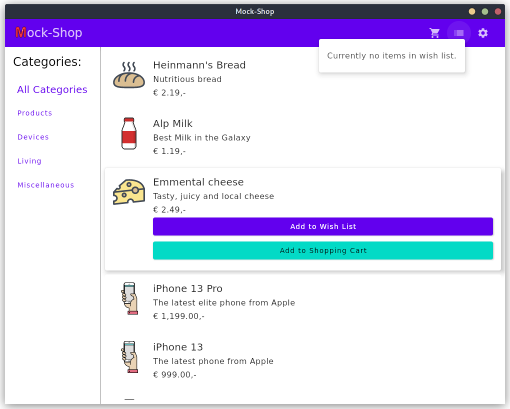
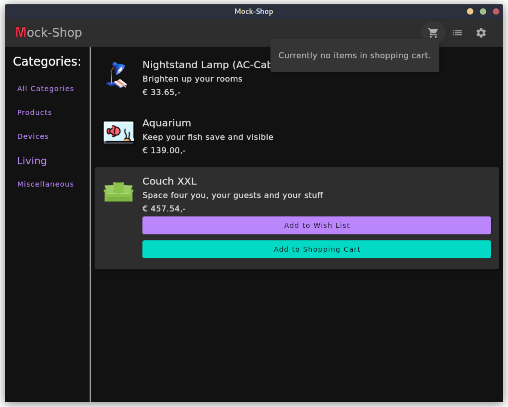
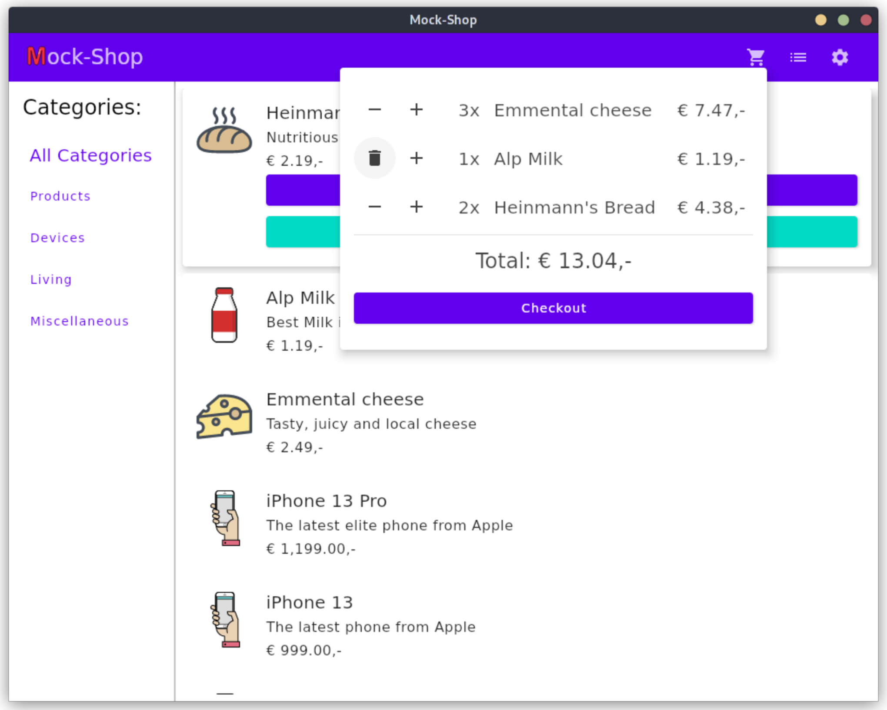
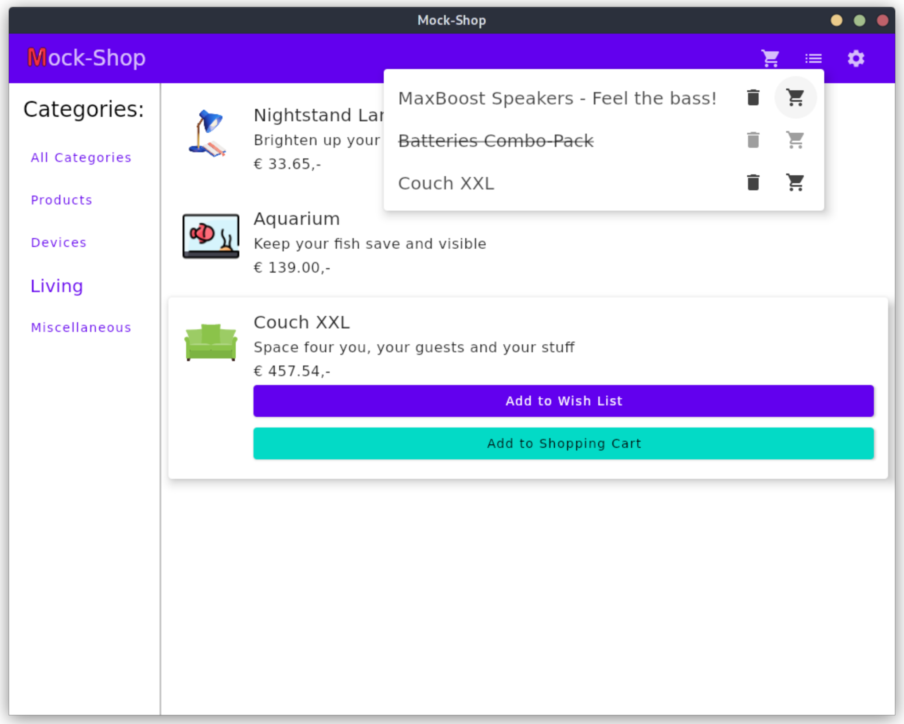
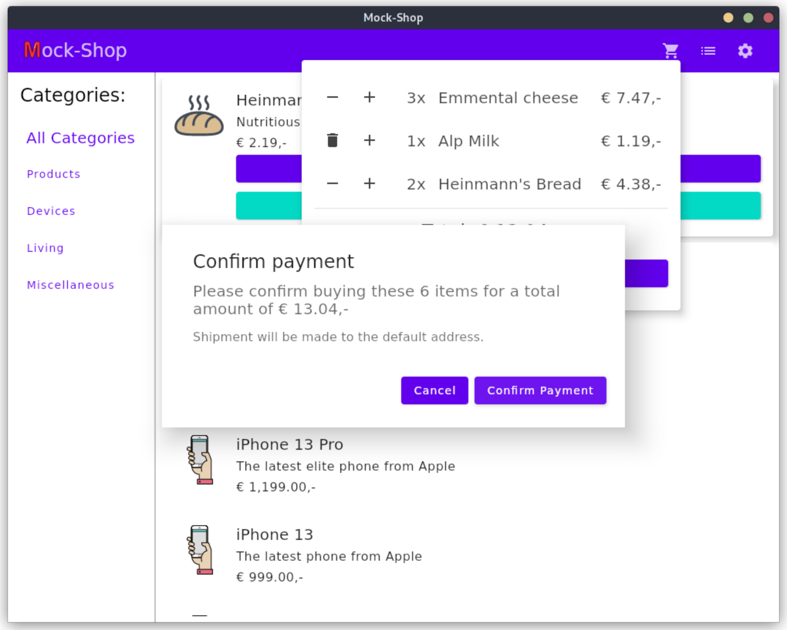

## Mock-shop

This is a demo application written using the multi-platform JetBrains Compose (Desktop) framework in Kotlin.    
It originated as a free-to-choose project assignment for the JKU course "Programming in Kotlin".

### Features

 - Browse through a bunch of (demo) products and either add them to the wish list, or the shopping cart
 - Filter and browse products by category
 - Manage the wish list by removing items, or move them over to the shopping cart
 - Customize the shopping cart by increasing, or decreasing/deleting each item's amount
 - See the (automatically recounted) total price for all items in the basket
 - Checkout with an alert confirm dialog
 - Smooth animations while interacting with UI elements
 - Instant dark mode switch (!)

### Screenshots

Main app view with an expanded item and empty wish list (light theme):    

Main app view with an expanded item and empty shopping cart (dark theme):    

Manage shopping list in a button-dropdown-preview:    

The wish list with an item already deleted:    

The alert dialog to confirm payment and shipping:    
